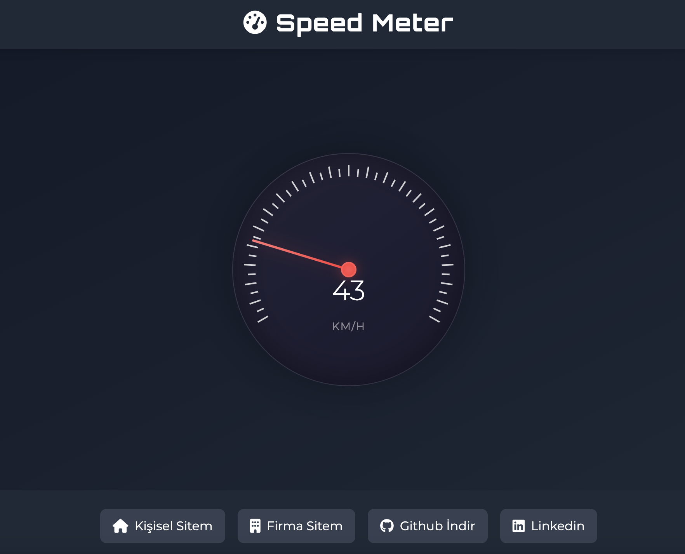

# Speed Meter

Modern ve interaktif bir hız göstergesi web uygulaması. Bu proje, şık bir tasarıma sahip dijital hız göstergesi simülasyonu sunar. Speed-data.json üzerinden veri kontrolü ile hız değerlerini değiştirebilirsiniz.

🌐 **[Canlı Demo](https://proje.alperenirtik.com/proje/speed-meter/)**



## 🚀 Özellikler

- Gerçek zamanlı hız göstergesi animasyonu
- Speed-data.json üzerinden veri kontrolü

## 🛠️ Kullanılan Teknolojiler

- HTML5
- CSS3
- JavaScript
- Tailwind CSS
- Font Awesome
- Google Fonts (Orbitron)

## 💨 Hız Verileri

Proje içerisindeki `speed-data.json` dosyası hız değerlerini içerir. Varsayılan olarak 0-220 km/h arasında 5'er km/h artışlı değerler tanımlanmıştır. 

İşte örnek yapı:

```json
{
    "speeds": [
        0, 5, 10, 15, 20, 25, 30, ..., 215, 220
    ]
}
```

Kendi hız değerlerinizi eklemek için:
1. `speed-data.json` dosyasını açın
2. `speeds` dizisine istediğiniz hız değerlerini ekleyin


## 💻 Kullanım

Hız göstergesi otomatik olarak çalışmaya başlayacaktır. Gösterge ibresi, belirlenen hız değerine göre hareket eder ve dijital ekranda anlık hız değeri görüntülenir.

## 👤 Geliştirici

**Alperen İrtik**

- Website: [alperenirtik.com](https://www.alperenirtik.com)
- GitHub: [@alperenirtik](https://github.com/alperenirtik)
- LinkedIn: [@alperen-irtik](https://www.linkedin.com/in/alperen-irtik-823564233)
- Firma Website: [ankasoftyazilim.com](https://www.ankasoftyazilim.com)
